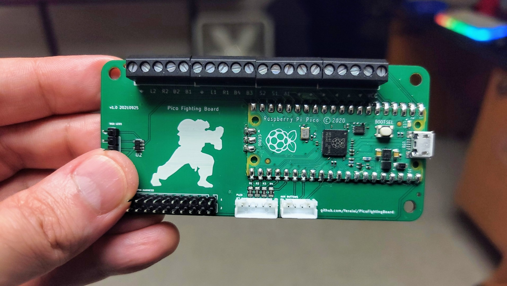

# Pico Fighting Board

Open source PCB for arcade sticks using Raspberry Pi Pico.

## Introduction

They say imitation is the highest form of flattery. If that's the case then the Brook line of arcade controller boards must be beet red from blushing. The Pico Fighting Board uses the same form factor and layout of the Brook PCBs to maintain compatibility with existing arcade stick cases, wiring harnesses, wire management accessories, etc.

This repository includes the KiCad source files along with the generated output files needed to get the PCB produced.

## Firmware

The [GP2040](https://github.com/FeralAI/GP2040) gamepad firmware for Pi Pico/RP2040 has a pre-configured firmware for use with the Pico Fighting Board. Just go the the latest release and download the `GP2040-PicoFightingBoard.uf2`. To flash:

1. Unplug your Pi Pico.
1. Hold the BOOTSEL button while plugging the Pico into your computer. A new removable drive named `RPI-RP2` should appear in your file explorer.
1. Drag and drop the `GP2040-PicoFightingBoard.uf2` file into the removable drive. This will flash the board.
1. The board should now be running the GP2040 firmware and should appear as a controller on your computer.

## KiCad

The `libraries` folder contains the schematics and footprints required to work with the KiCad source files. KiCad 5.1.9 was used for these instructions.

### Libraries

Add the Raspberry Pi Pico schematic:

1. From the KiCad `Preferences` menu, select `Manage Symbol Libraries...`.
1. In the `Global Libraries` tab, click the folder icon.
1. Navigate to this repository, then navigate to `libraries/RP-Pico Libraries` and select the `MCU_RaspberryPi_and_Boards.lib` file.
1. Click `OK` to finish.

### Footprints

1. From the KiCad `Preferences` menu, select `Manage Footprint Libraries...`.
1. In the `Global Libraries` tab, click the folder icon.
1. In the `Select Libary` dialog, navigate to `libraries/RP-Pico Libraries/MCU_RaspberryPi_and_Boards.pretty` in this repository.
1. Click `OK` to confirm the folder selection.
1. Repeat the same process for the `libraries/FeralAI/FeralAI.pretty` folder.
1. Click `OK` to finish.

## Purchasing

If you don't want to manufacture your own board, or would like to support this project, the Pico Fighting Board is available for purchase here: https://shop.feralai.com/product/pico-fighting-board
